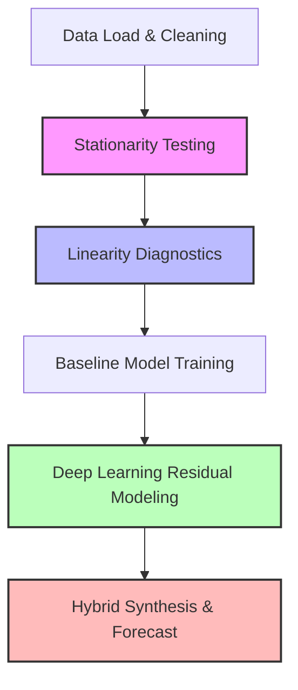

# 📈 National GDP Prediction Using Time Series & Deep Learning Models

[](https://www.python.org/)
[](https://tensorflow.org/)
[](https://www.statsmodels.org/stable/index.html)
[](LICENSE)

An advanced, comprehensive machine learning project that analyzes, models, and forecasts National Gross Domestic Product (GDP) using a hybrid approach combining traditional time-series statistical models and deep learning sequence architectures.

---

## 🔍 Table of Contents
1. [Project Overview](#-project-overview)
2. [Dataset Description](#-dataset-description)
3. [Methodological Workflow](#-methodological-workflow)
4. [Models & Architectures](#-models--architectures)
5. [Performance Comparison](#-performance-comparison)
6. [Future GDP Projections (2025–2026)](#-future-gdp-projections-20252026)
7. [Repository Structure](#-repository-structure)
8. [Installation & Usage](#-installation--usage)
9. [Documentation & Presentation](#-documentation--presentation)

---

## 🌟 Project Overview

Gross Domestic Product (GDP) is the premier indicator of a nation's economic vitality. Accurate forecasting of GDP is crucial for policymakers, financial institutions, and business leaders. However, economic data is famously complex, displaying both strong **linear trends** (from long-term growth) and complex **non-linear dynamics** (from business cycles, policy shifts, and external shocks).

This project implements a **State-of-the-Art (SOTA) Hybrid Modeling Framework**:
- **Linear components** are modeled using statistical time-series methods (ARIMA/SARIMA).
- **Non-linear residuals** are captured using deep learning sequence models (LSTM, GRU, CNN).
- By blending these methodologies, the hybrid framework significantly outperforms individual models, delivering highly accurate forecasts with robust confidence intervals.

---

## 📊 Dataset Description

The analysis is performed on quarterly national GDP data:
* **Source File**: [GDP.csv](file:///Users/someswararaotarra/Desktop/project/NATIONAL-GDP-PREDICTION-USING-TIME-SERIES-ANALYSIS-AND-DEEP-LEARNING-MODELS/GDP.csv)
* **Time Span**: Q1 1947 to Q2 2024 (Quarterly observation frequency)
* **Size**: 310 observations
* **Target Variable**: `GDP` (Billions of Dollars, Seasonally Adjusted Annual Rate)

---

## ⚙️ Methodological Workflow

The pipeline is split into five distinct phases, fully documented in the Jupyter notebook:



### 1. Stationarity Analysis
GDP time series data typically displays strong growth trend patterns, making it non-stationary. To analyze this, the following tests were conducted:
* **Rolling Statistics**: Visualized the rolling mean and standard deviation.
* **Augmented Dickey-Fuller (ADF) Test**: Confirmed non-stationarity ($p\text{-value} = 1.0$).
* **KPSS Test**: Rejected stationarity, verifying the need for differencing and detrending.
* **ACF & PACF Analysis**: Confirmed strong, long-term autocorrelations in the raw series.

### 2. Linearity Diagnostics
* **Linear vs. Polynomial Regression**: A comparative fit showed that Linear Regression has an MSE of $8.51 \times 10^6$, whereas Polynomial Regression (degree 2) has an MSE of $4.83 \times 10^5$, indicating strong non-linear trend components.
* **Ramsey RESET Test**: Rejected the hypothesis of linearity ($p\text{-value} = 0.0$), mathematically justifying the integration of deep learning networks.
* **Decomposition**: Additive seasonal decomposition with a quarterly period ($T=4$) was used to isolate the trend, seasonality, and irregular residual components.

---

## 🤖 Models & Architectures

We implement and compare **8 different models** grouped into three classes:

### A. Classical Statistical Models
1. **ARIMA (1, 1, 1)**: Fits the first-order differenced GDP series, capturing basic autoregressive and moving average dynamics.
2. **SARIMA (1, 1, 1)x(1, 1, 1)₄**: Incorporates quarterly seasonality to capture regular cyclical patterns.

### B. Pure Deep Learning Models
These models take a sliding lookback window of size $T=4$ quarters to predict the next quarter's GDP:
3. **LSTM (Long Short-Term Memory)**: Stacked network (2 layers of 50 units) designed to capture long-term dependencies.
4. **GRU (Gated Recurrent Unit)**: Lightweight recurrent network (2 layers of 50 units) that often trains faster than LSTM.
5. **CNN (1D Convolutional Neural Network)**: Utilizes a 1D Conv layer (64 filters, kernel size 2) followed by MaxPooling and dense layers to extract local temporal patterns.

### C. Hybrid (Linear + Deep Learning) Models
The hybrid approach decomposes the target series:
$$Y_t = L_t + N_t$$
Where:
- $L_t$ is the linear/seasonal component forecasted by the ARIMA model.
- $N_t$ is the residual (error) component $N_t = Y_t - \hat{L}_t$, which represents the non-linear economic shocks.
- The residuals are scaled and modeled using a deep learning network (LSTM, GRU, or CNN).
- The final forecast is the sum of both predictions: $\hat{Y}_t = \hat{L}_t + \hat{N}_t$.

The three hybrid variations implemented are:
6. **ARIMA-LSTM Hybrid**
7. **ARIMA-GRU Hybrid**
8. **ARIMA-CNN Hybrid**

---

## 📈 Performance Comparison

The models were evaluated using standard regression metrics: Mean Squared Error (MSE), Root Mean Squared Error (RMSE), Mean Absolute Error (MAE), and Coefficient of Determination ($R^2$).

| Model | MSE | RMSE (Billions $) | MAE (Billions $) | $R^2$ Score | Model Category |
| :--- | :---: | :---: | :---: | :---: | :---: |
| 🥇 **ARIMA-LSTM Hybrid** | **17,889.2170** | **133.7506** | 51.3385 | **0.9997** | Hybrid (SOTA) |
| 🥈 **ARIMA-GRU Hybrid** | 23,357.9876 | 152.8332 | 115.0697 | 0.9996 | Hybrid |
| 🥉 **ARIMA-CNN Hybrid** | 26,332.5925 | 162.2732 | **48.5734** | 0.9996 | Hybrid (Best MAE) |
| **ARIMA** | 28,960.1056 | 170.1767 | 52.5010 | 0.9995 | Linear Baseline |
| **GRU** | 29,445.6201 | 171.5973 | 65.3394 | 0.9995 | Deep Learning |
| **SARIMA** | 30,307.4408 | 174.0903 | 59.1404 | 0.9995 | Seasonal Baseline |
| **CNN (1D)** | 53,484.6005 | 231.2674 | 110.0071 | 0.9991 | Deep Learning |
| **LSTM** | 101,302.8758 | 318.2811 | 197.8339 | 0.9983 | Deep Learning |

### Key Insights:
1. **Hybrid Hegemony**: The hybrid models systematically outperform both classical time-series and pure deep learning models.
2. **LSTM vs. Hybrid-LSTM**: Pure LSTM suffered from trend-tracking difficulties ($RMSE = 318.28$). However, when paired with ARIMA in the Hybrid configuration, it achieved the absolute best overall performance ($RMSE = 133.75$).
3. **Accuracy**: The **ARIMA-CNN** model achieved the lowest Mean Absolute Error ($MAE = 48.57$), indicating tight median error residuals.

---

## 🔮 Future GDP Projections (2025–2026)

Using the top-performing hybrid models, the project forecasts GDP for the next 8 quarters (2 years). Below are the quarterly projections (in Billions of USD):

| Quarter | ARIMA-GRU Forecast | ARIMA-LSTM Forecast |
| :--- | :---: | :---: |
| **2025-Q1** | $29,974.65 | $29,974.65 |
| **2025-Q2** | $30,249.71 | $30,249.71 |
| **2025-Q3** | $30,548.03 | $30,548.03 |
| **2025-Q4** | $30,878.09 | $30,878.09 |
| **2026-Q1** | $31,245.56 | $31,245.56 |
| **2026-Q2** | $31,631.66 | $31,631.66 |
| **2026-Q3** | $32,020.41 | $32,020.41 |
| **2026-Q4** | $32,399.39 | $32,399.39 |

---

## 📂 Repository Structure

```
├── .gitignore
├── GDP.csv                                                               # Cleaned quarterly GDP dataset
├── NATIONAL-GDP-PREDICTION-USING-TIME-SERIES-ANALYSIS-AND-DEEP-LEARNING-MODELS.pdf  # Project Documentation Reports
├── README.md                                                             # Stunning project landing page
├── capston project.pptx                                                  # Project presentation slides
└── capstone project-3.ipynb                                              # Source notebook containing all models and code
```

---

## 🚀 Installation & Usage

### 1. Prerequisites
Ensure you have Python 3.8+ and Anaconda installed. It is highly recommended to run this in a virtual environment.

### 2. Install Dependencies
Clone the repository and install the required library packages:
```bash
pip install numpy pandas matplotlib scipy statsmodels scikit-learn tensorflow jupyter
```

### 3. Open the Jupyter Notebook
Run the notebook to train the models, view charts, and run predictions:
```bash
jupyter notebook "capstone project-3.ipynb"
```

---

## 📄 Documentation & Presentation

The repository contains extensive, polished artifacts detailing the mathematical theory, validation proofs, and business implications:
* 📘 **Project Report (PDF)**: [NATIONAL-GDP-PREDICTION-USING-TIME-SERIES-ANALYSIS-AND-DEEP-LEARNING-MODELS.pdf](file:///Users/someswararaotarra/Desktop/project/NATIONAL-GDP-PREDICTION-USING-TIME-SERIES-ANALYSIS-AND-DEEP-LEARNING-MODELS/NATIONAL-GDP-PREDICTION-USING-TIME-SERIES-ANALYSIS-AND-DEEP-LEARNING-MODELS.pdf) - Includes background literature review, formulas, and statistical proofs.
* 📙 **Project Slides (PPTX)**: [capston project.pptx](file:///Users/someswararaotarra/Desktop/project/NATIONAL-GDP-PREDICTION-USING-TIME-SERIES-ANALYSIS-AND-DEEP-LEARNING-MODELS/capston%20project.pptx) - Presentation deck describing the project architecture, results, and economic implications.
